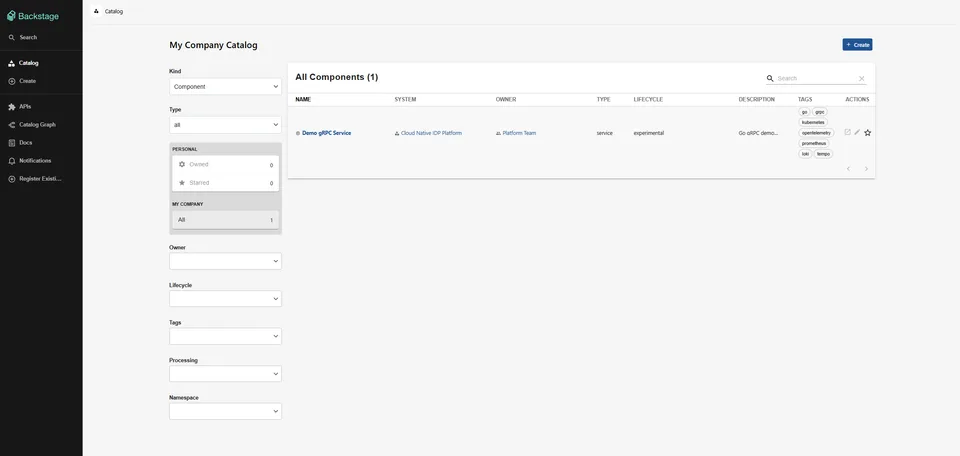
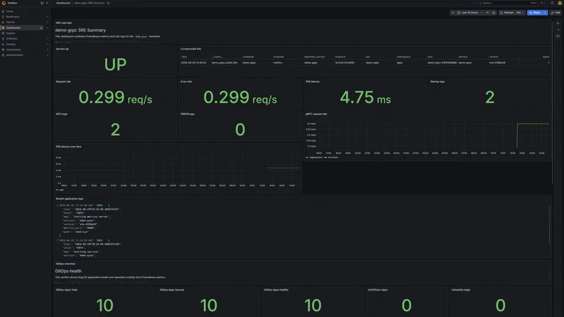

# Cloud-Native Internal Developer Platform

> A local-first Kubernetes IDP that turns Backstage golden paths into GitOps-delivered services with observable, policy-governed runtime operations.

Validated with Argo CD state, executable checks, and screenshots across service delivery, SRE, security governance, backup/restore, Vault, cost visibility, and the developer portal.

[](https://github.com/goozcena-gnl/cloud-native-idp-platform/actions/workflows/ci.yml)
[](https://github.com/goozcena-gnl/cloud-native-idp-platform/actions/workflows/plumber.yml)
[](https://github.com/goozcena-gnl/cloud-native-idp-platform/actions/workflows/publish-demo-grpc.yml)
[](https://github.com/goozcena-gnl/cloud-native-idp-platform/releases/latest)
[](LICENSE)

Evidence: [validation model](#validation-model) and [indexed screenshots](docs/EVIDENCE_INDEX.md).

<table>
  <tr>
    <td width="50%" valign="top">
      
      <br /><sub><strong>Developer experience evidence.</strong> The retained Backstage catalog shows the demo service registered to the platform team with its Kubernetes and telemetry metadata.</sub>
    </td>
    <td width="50%" valign="top">
      
      <br /><sub><strong>Observability evidence.</strong> The retained Grafana dashboard correlates service health, golden signals, logs, build identity, and GitOps state from the local validation run.</sub>
    </td>
  </tr>
</table>

## Architecture and technical navigation

[Architecture and Capabilities Summary](docs/ARCHITECTURE_AND_CAPABILITIES.md)
is the canonical technical reference for platform layers, GitOps delivery,
capabilities, validation, local-first decisions, and production improvements.
Use the shorter [Architecture Overview](docs/ARCHITECTURE.md) for the target and
MVP boundary, then follow the [documentation index](docs/DOCUMENTATION_INDEX.md)
for detailed operations, security, evidence, and architecture decisions.

```text
Developer
  -> GitHub repository
  -> GitHub Actions CI
  -> ArgoCD app-of-apps
  -> kind Kubernetes cluster
      -> demo-grpc service
      -> observability stack
      -> security governance
      -> runtime operations
      -> Backstage developer portal
```

Core platform layers:

```text
GitOps             ArgoCD
Workload           Go gRPC demo service
Packaging          Docker + Helm
Observability      Prometheus, Grafana, Loki, Tempo, OpenTelemetry
Security           Kyverno, NetworkPolicies, Pod Security Admission
Runtime Security   Falco
Cost Visibility    OpenCost
Backup / DR        Velero + MinIO
Secrets            Vault + Kubernetes Auth
Developer Portal   Backstage
```

## Capabilities and boundaries

The sections below describe the implemented platform surfaces and their
executable or retained evidence. The deployment is intentionally
[local-first](#local-first-design); [production improvements](#production-note)
remain explicit design considerations rather than claims about the current
runtime.

### GitOps

- Argo CD AppProject;
- app-of-apps pattern;
- automated sync;
- prune and self-heal;
- all platform applications managed declaratively.

### Demo service

The reference service is `demo-grpc`, a Go gRPC service used to validate the full platform lifecycle.

It includes:

- Docker image;
- Helm chart;
- Kubernetes deployment;
- gRPC health checks;
- Prometheus metrics;
- OpenTelemetry traces;
- structured logs;
- log-to-trace correlation;
- hardened security context.

### Observability and SRE

The observability layer includes:

- Prometheus metrics;
- Grafana dashboards;
- Loki logs;
- Tempo traces;
- OpenTelemetry instrumentation;
- alerting rules;
- SLO documentation;
- incident drills.

Documentation:

- [Observability and SRE](docs/PORTFOLIO_OBSERVABILITY_SRE.md)
- [Incident drills](docs/INCIDENT_DRILLS.md)

### Security governance

The security layer includes:

- Pod Security Admission labels;
- hardened workload baseline;
- Kyverno policies;
- Kyverno audit-mode validation;
- NetworkPolicy default-deny model;
- security validation scripts.

Documentation:

- [Security governance](docs/SECURITY_GOVERNANCE.md)
- [DevSecOps and CI/CD supply-chain security](docs/DEVSECOPS.md)

The dedicated `Plumber CI/CD Security` workflow analyzes every GitHub Actions
workflow and local composite action on pull requests, pushes to `main`, and
manual runs. It enforces a minimum Plumber score of `A`, publishes SARIF to
GitHub Code Scanning, and retains JSON, SARIF, PBOM, and CycloneDX reports as
short-lived workflow artifacts. Plumber score publication to the external badge
service is intentionally disabled.

### Runtime operations

The runtime operations layer includes:

- OpenCost for cost visibility;
- Falco for runtime threat detection;
- Velero and MinIO for backup and restore;
- Vault for secrets management;
- Vault Kubernetes auth validation.

Documentation:

- [Runtime operations summary](docs/PHASE_7_RUNTIME_OPERATIONS.md)
- [Cost visibility](docs/COST_VISIBILITY.md)
- [Runtime security](docs/RUNTIME_SECURITY.md)
- [Backup and disaster recovery](docs/BACKUP_AND_DISASTER_RECOVERY.md)
- [Secrets management](docs/SECRETS_MANAGEMENT.md)

### Developer Experience

The developer experience layer includes:

- Backstage service catalog;
- Backstage developer portal;
- `Component/demo-grpc`;
- `API/demo-grpc-api`;
- `Group/platform-team`;
- Developer Golden Path;
- Production Readiness Scorecard;
- Go gRPC Backstage software template.

Documentation:

- [Platform Engineering and Developer Experience](docs/PHASE_8_PLATFORM_ENGINEERING_DEVELOPER_EXPERIENCE.md)
- [Developer Golden Path](docs/DEVELOPER_GOLDEN_PATH.md)
- [Production Readiness Scorecard](docs/PRODUCTION_READINESS_SCORECARD.md)
- [Developer Portal with Backstage](docs/DEVELOPER_PORTAL_BACKSTAGE.md)

## Validation model

This project is validated through three evidence layers:

1. **GitOps state**

Argo CD applications must be `Synced` and `Healthy`.
2. **Executable validation scripts**

Each important platform capability has a validation script under `scripts/`.
3. **Visual evidence**

Screenshots are stored under `docs/assets/`.

## Key validation scripts

```text
./scripts/check-portfolio-package.sh
./scripts/check-argocd-apps.sh
./scripts/check-demo-grpc-security-baseline.sh
./scripts/check-demo-grpc-log-trace-correlation.sh
./scripts/check-platform-alerts.sh
./scripts/check-kyverno-stack.sh
./scripts/check-network-policies.sh
./scripts/check-opencost-stack.sh
./scripts/check-falco-stack.sh
./scripts/check-velero-backup-restore.sh
./scripts/check-vault-kubernetes-auth.sh
./scripts/check-backstage-stack.sh
./scripts/check-backstage-software-template.sh
```

## Documentation index

Start here:

- [Canonical architecture and capabilities](docs/ARCHITECTURE_AND_CAPABILITIES.md)
- [Concise architecture overview](docs/ARCHITECTURE.md)
- [Documentation index](docs/DOCUMENTATION_INDEX.md)
- [Evidence index](docs/EVIDENCE_INDEX.md)

Architecture decisions:

- [ADR 0001: Local-first platform strategy](docs/adr/0001-local-first-platform-strategy.md)
- [ADR 0002: GitOps as source of truth](docs/adr/0002-gitops-as-source-of-truth.md)
- [ADR 0003: Hybrid repository strategy](docs/adr/0003-hybrid-repository-strategy.md)
- [ADR 0004: Local execution strategy](docs/adr/0004-local-execution-strategy.md)

## Evidence assets

Screenshots and visual proof are stored under:

```text
docs/assets/
```

Main evidence folders:

```text
docs/assets/observability-sre/
docs/assets/security-governance/
docs/assets/backup-disaster-recovery/
docs/assets/secrets-management/
docs/assets/developer-portal/
```

## Repository structure

```text
.
├── catalog-info.yaml
├── charts/
├── developer-portal/
│   └── backstage/
├── docs/
│   ├── assets/
│   └── *.md
├── platform/
│   ├── argocd/
│   ├── backup/
│   ├── developer-portal/
│   ├── grafana/
│   ├── namespaces/
│   ├── observability/
│   └── security/
├── scripts/
└── services/
    └── demo-grpc/
```

## Local-first design

This project is intentionally local-first.

It uses:

- kind for Kubernetes;
- local Docker images;
- local MinIO for Velero;
- Vault dev mode for secrets validation;
- local Backstage image;
- simplified local authentication.

These choices make the platform reproducible on a local workstation while still demonstrating real DevOps, SRE, GitOps and platform engineering concepts.

## Production note

This is not presented as a production deployment.

Production improvements would include:

- managed Kubernetes;
- real ingress and TLS;
- external DNS;
- production-grade Vault storage and unseal;
- persistent PostgreSQL for Backstage;
- external object storage for Velero;
- production authentication and RBAC;
- hardened supply chain and image signing;
- cloud billing integration;
- high availability and disaster recovery across failure domains.

## License

Original project content is licensed under the [Apache License 2.0](LICENSE).
Third-party and upstream components remain subject to their own licenses and
retained copyright notices.
