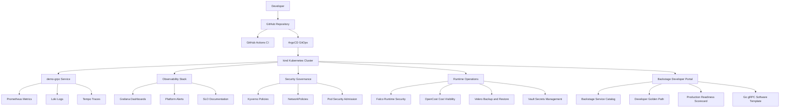

# Architecture and Capabilities Summary

## Purpose

This document summarizes the architecture and capabilities of the Cloud Native IDP Platform.

It is designed as a technical interview support document for explaining:

- what the platform does;
- how the components interact;
- which DevOps, SRE, security and platform engineering capabilities are demonstrated;
- what is intentionally local-first;
- what would change for a production-grade deployment.

## High-level architecture



## Platform layers

| Layer | Tools | Purpose |
| --- | --- | --- |
| Source control | GitHub | Repository, versioning and portfolio evidence |
| CI/CD | GitHub Actions | Test, build and validation workflows |
| GitOps | ArgoCD | Declarative platform delivery |
| Kubernetes | kind | Local Kubernetes runtime |
| Workload | Go gRPC service | Reference application for platform validation |
| Packaging | Docker, Helm | Container and Kubernetes release packaging |
| Observability | Prometheus, Grafana, Loki, Tempo, OpenTelemetry | Metrics, dashboards, logs, traces and correlation |
| Security governance | Kyverno, NetworkPolicy, PSA | Kubernetes policy and isolation baseline |
| Runtime security | Falco | Runtime threat detection |
| Cost visibility | OpenCost | Kubernetes cost observability |
| Backup / DR | Velero, MinIO | Backup and restore validation |
| Secrets | Vault | Secrets management and Kubernetes authentication |
| Developer portal | Backstage | Service catalog and self-service developer experience |

## GitOps model

The platform uses ArgoCD as the control plane for delivery.

Capabilities demonstrated:

- AppProject isolation;
- app-of-apps pattern;
- automated sync;
- prune and self-heal;
- declarative application definitions;
- platform components managed as Kubernetes manifests or Helm releases.

Expected final state:

```text
All ArgoCD applications: Synced / Healthy
```

## Reference workload

The reference workload is `demo-grpc`.

It is used to validate the complete platform lifecycle:

- source code;
- Docker image;
- Helm chart;
- Kubernetes deployment;
- health checks;
- metrics;
- logs;
- traces;
- dashboarding;
- alerting;
- security baseline;
- NetworkPolicy;
- service catalog metadata.

This makes the service a realistic validation target instead of a passive demo application.

## Observability capabilities

The observability stack demonstrates:

- Prometheus metrics collection;
- Grafana dashboards;
- Loki log aggregation;
- Tempo distributed tracing;
- OpenTelemetry instrumentation;
- structured JSON logs;
- trace ID propagation;
- log-to-trace correlation;
- SLO documentation;
- incident drills;
- alert validation.

Key proof:

```text
./scripts/check-demo-grpc-log-trace-correlation.sh
./scripts/check-platform-alerts.sh
```

## Security capabilities

The security layer demonstrates:

- Pod Security Admission labels;
- hardened workload security context;
- non-root containers;
- dropped Linux capabilities;
- read-only root filesystem;
- Kyverno policy validation;
- audit-mode policy governance;
- NetworkPolicy isolation;
- validation scripts for repeatable evidence.

Key proof:

```text
./scripts/check-demo-grpc-security-baseline.sh
./scripts/check-kyverno-stack.sh
./scripts/check-network-policies.sh
```

## Runtime operations capabilities

The runtime operations layer demonstrates Day-2 platform capabilities.

Delivered:

- OpenCost for cost visibility;
- Falco for runtime security detection;
- Velero and MinIO for backup and restore;
- Vault for secrets management;
- Vault Kubernetes auth for workload identity-style secret access.

Key proof:

```text
./scripts/check-opencost-stack.sh
./scripts/check-falco-stack.sh
./scripts/check-velero-backup-restore.sh
./scripts/check-vault-kubernetes-auth.sh
```

## Developer Experience capabilities

The developer experience layer demonstrates platform engineering maturity.

Delivered:

- Backstage developer portal;
- Backstage service catalog;
- ownership model;
- catalog entities for service, API, resources and team;
- Developer Golden Path;
- Production Readiness Scorecard;
- Go gRPC software template.

Key proof:

```text
./scripts/check-backstage-stack.sh
./scripts/check-backstage-software-template.sh
```

## Validation strategy

The project uses repeatable validation instead of only screenshots.

Validation layers:

1. Git state:

- clean working tree;
- pushed commits;
- green CI.
2. GitOps state:

- ArgoCD applications are `Synced` and `Healthy`.
3. Capability scripts:

- each important platform capability has a validation script.
4. Evidence:

- screenshots stored under `docs/assets/`.

Final validation:

```text
./scripts/check-final-platform.sh
```

Full validation:

```text
FULL_VALIDATION=true ./scripts/check-final-platform.sh
```

## Local-first design choices

This project is intentionally local-first.

Local choices:

- kind instead of a managed Kubernetes service;
- local Docker images;
- local MinIO object storage;
- Vault dev mode;
- local Backstage image;
- simplified authentication;
- local port-forward access.

These choices reduce cost and make the project reproducible on a workstation while still demonstrating real platform engineering concepts.

## Production-grade improvements

For production, the main improvements would be:

- managed Kubernetes or hardened self-managed Kubernetes;
- real ingress and TLS;
- external DNS;
- production Vault storage and unseal;
- external PostgreSQL for Backstage;
- external object storage for Velero;
- real authentication and RBAC;
- image signing with Cosign;
- SBOM generation;
- stronger supply chain controls;
- cloud cost integration;
- high availability;
- disaster recovery across failure domains.

## Interview talking points

This project can be explained around five main points:

1. **GitOps platform delivery**

ArgoCD continuously reconciles the desired state of the platform.
2. **Observable service lifecycle**

The `demo-grpc` service proves metrics, logs, traces, dashboards, alerts and incident drills.
3. **Security by default**

Workloads are hardened and governed through Pod Security Admission, Kyverno and NetworkPolicies.
4. **Day-2 operations**

The platform includes runtime detection, cost visibility, backup and restore, and secrets management.
5. **Developer Experience**

Backstage provides service discovery and a first self-service software template aligned with a documented golden path.

## Outcome

The platform demonstrates the ability to design, implement, validate and document a cloud-native Internal Developer Platform.

It is suitable for technical discussion around:

- Kubernetes;
- GitOps;
- CI/CD;
- observability;
- SRE;
- DevSecOps;
- runtime operations;
- secrets management;
- backup and disaster recovery;
- platform engineering;
- developer experience.