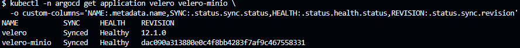
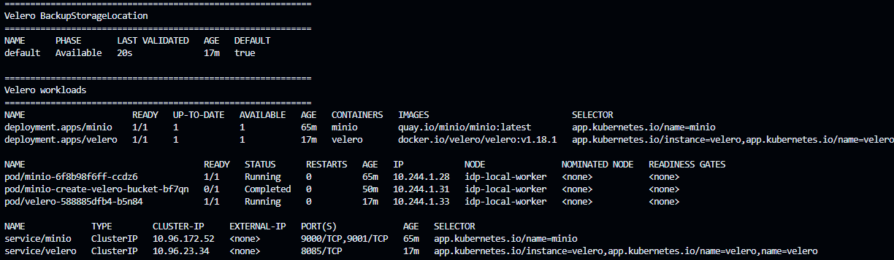
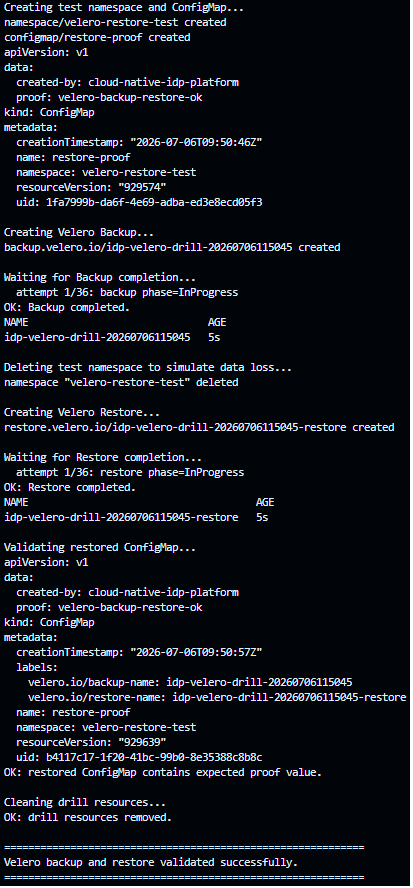
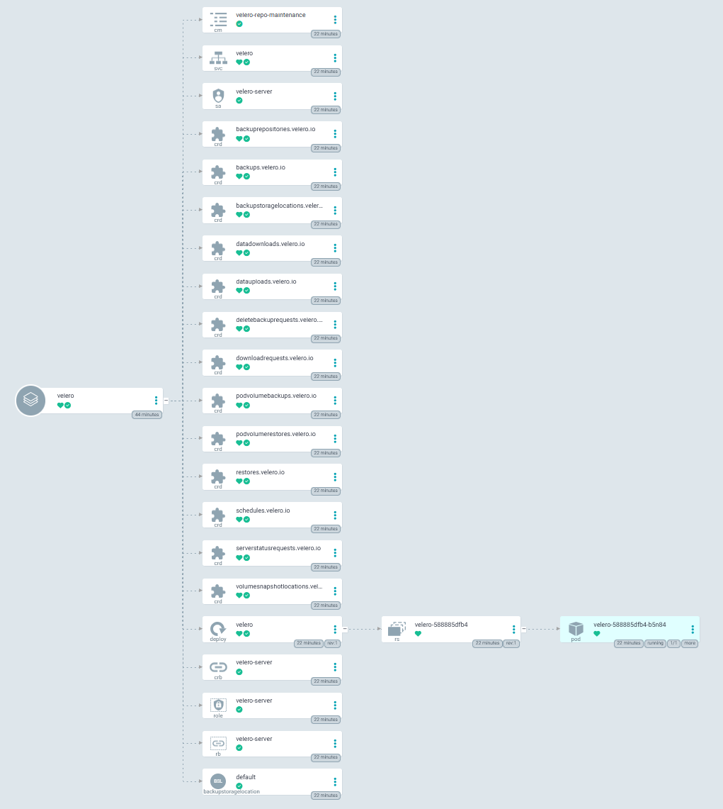
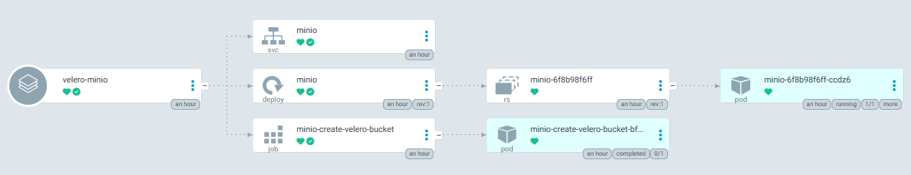

# Backup and Disaster Recovery with Velero

## Goal

This section demonstrates backup and restore capabilities for the local Kubernetes platform using Velero and an S3-compatible MinIO backend.

The objective is not only to install Velero, but to prove that the platform can recover Kubernetes resources after simulated data loss.

## Architecture

```text
ArgoCD
  -> velero-minio application
  -> MinIO deployment
  -> MinIO service
  -> bucket creation Job
  -> S3-compatible bucket: velero
  -> velero application
  -> Velero deployment
  -> AWS plugin
  -> BackupStorageLocation
  -> Restore capability
```

## Components

| Component | Purpose |
| --- | --- |
| Velero | Kubernetes backup and restore controller |
| MinIO | Local S3-compatible object storage backend |
| `cloud-credentials` Secret | Credentials used by Velero to access MinIO |
| BackupStorageLocation | Defines the target object storage bucket |
| Backup | Captures selected Kubernetes resources |
| Restore | Recreates resources from a completed backup |

## GitOps model

Velero and MinIO are managed through ArgoCD applications:

```text
velero-minio   Synced   Healthy
velero         Synced   Healthy
```

The MinIO bucket creation is automated by a Kubernetes Job managed through GitOps.

## Validation drill

The backup and restore drill validates the following flow:

```text
1. Create a test namespace.
2. Create a ConfigMap containing a proof value.
3. Create a Velero Backup.
4. Wait for the Backup to complete.
5. Delete the namespace to simulate data loss.
6. Create a Velero Restore.
7. Verify that the ConfigMap is restored with the expected data.
8. Clean up test resources.
```

Validation script:

```bash
./scripts/check-velero-backup-restore.sh
```

Successful result:

```text
BackupStorageLocation default is Available.
Backup completed.
Restore completed.
restored ConfigMap contains expected proof value.
Velero backup and restore validated successfully.
```

## Evidence

The drill restored the following ConfigMap after namespace deletion:

```yaml
apiVersion: v1
kind: ConfigMap
metadata:
  name: restore-proof
  namespace: velero-restore-test
  labels:
    velero.io/backup-name: idp-velero-drill
    velero.io/restore-name: idp-velero-drill-restore
data:
  created-by: cloud-native-idp-platform
  proof: velero-backup-restore-ok
```

## Screenshot evidence

### 1. Velero and MinIO managed by ArgoCD



This screenshot proves that both `velero` and `velero-minio` are managed declaratively through ArgoCD and are `Synced` / `Healthy`.

### 2. BackupStorageLocation available



This screenshot proves that Velero can reach the MinIO S3-compatible backend and that the default `BackupStorageLocation` is `Available`.

### 3. Backup and restore drill success



This screenshot proves the complete disaster recovery flow: backup creation, namespace deletion, restore execution, and restored ConfigMap validation.

### 4. Velero resource tree in ArgoCD



This screenshot shows the live Velero resources managed by the GitOps application.

### 5. MinIO backend resource tree in ArgoCD



This screenshot shows the local S3-compatible backend used by Velero, including the MinIO workload and bucket creation job.


## Operational value

This validates that the platform can recover Kubernetes resources after accidental deletion or namespace-level data loss.

In a production platform, this pattern would be extended with:

- persistent volume backup;
- scheduled backups;
- retention policies;
- off-cluster object storage;
- restore runbooks;
- periodic disaster recovery drills;
- alerting on backup failures.

## Current limitations

This local implementation uses MinIO with ephemeral storage, so it is suitable for learning and portfolio demonstration, not production durability.

A production-grade implementation would use an external object storage backend such as AWS S3, Azure Blob Storage, Google Cloud Storage, or a resilient on-prem S3-compatible backend.