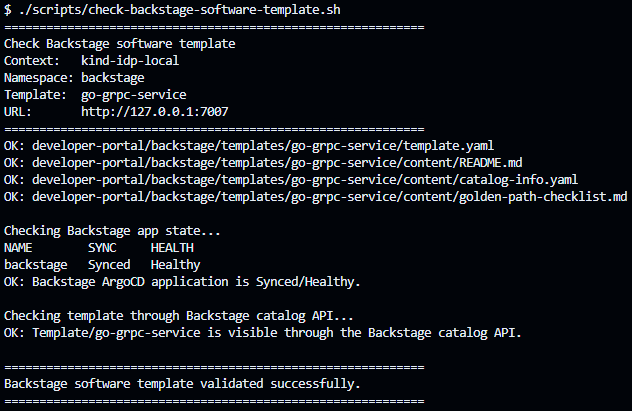
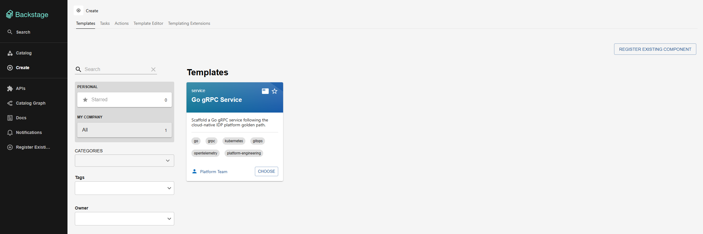

# Developer Portal with Backstage

## Goal

This document describes the Backstage developer portal deployed as part of the cloud-native IDP platform.

The goal is to provide a developer-facing entry point for service discovery, ownership, platform documentation and future golden paths.

## Delivered capabilities

The platform now includes:

- a generated Backstage application;
- a Backstage-compatible service catalog;
- a local Docker image `backstage:local`;
- a PostgreSQL backend for Backstage;
- a Kubernetes deployment managed by ArgoCD;
- Backstage configured to import the platform catalog;
- validation of the `demo-grpc` service through the Backstage catalog API.

## Architecture

```text
catalog-info.yaml
  -> developer-portal/backstage/catalog/platform-catalog-info.yaml
  -> Backstage catalog processor
  -> Backstage UI
  -> demo-grpc catalog entity
```

Kubernetes deployment:

```text
ArgoCD Application/backstage
  -> Namespace/backstage
  -> Deployment/backstage
  -> Deployment/backstage-postgresql
  -> Service/backstage
  -> Service/backstage-postgresql
```

## GitOps model

Backstage is deployed through ArgoCD:

```text
platform/argocd/apps/backstage.yaml
platform/developer-portal/backstage/
```

Expected state:

```text
backstage   Synced   Healthy
```

The Backstage image is built locally and loaded into the kind cluster:

```text
./scripts/build-backstage-kind-image.sh
```

Local secrets are configured with:

```text
./scripts/configure-backstage-secrets.sh
```

## Validation

The full stack is validated by:

```text
./scripts/check-backstage-stack.sh
```

The validation checks:

- ArgoCD application state;
- namespace labels;
- Backstage and PostgreSQL workloads;
- rollout status;
- local port-forward access;
- Backstage UI availability;
- `demo-grpc` visibility through the catalog API.

Successful result:

```text
OK: Backstage UI is reachable.
OK: demo-grpc entity is visible through the Backstage catalog API.
Backstage stack validated successfully.
```

## Evidence

### 1. ArgoCD Backstage application synced and healthy

### 2. Backstage stack validation

### 3. Backstage UI home

### 4. demo-grpc catalog entity

### 5. ArgoCD Backstage resource tree

## Software Template

Backstage also exposes a software template for the platform golden path:

```text
Go gRPC Service
```

The template is defined in:

```text
developer-portal/backstage/templates/go-grpc-service/template.yaml
```

It provides a starting point for scaffolding a Go gRPC service aligned with the platform conventions:

- service metadata;
- owner and system parameters;
- gRPC port;
- metrics port;
- generated `catalog-info.yaml`;
- generated golden path checklist;
- reminder to follow the Developer Golden Path and Production Readiness Scorecard.

The template is validated by:

```text
./scripts/check-backstage-software-template.sh
```

Successful result:

```text
OK: Template/go-grpc-service is visible through the Backstage catalog API.
Backstage software template validated successfully.
```

### 6. Backstage software template validation



### 7. Go gRPC Service software template



## Developer Experience value

Backstage turns the platform into a more discoverable Internal Developer Platform.

Instead of only exposing Kubernetes manifests and scripts, the platform now provides a developer portal foundation where services can be represented with:

- ownership;
- lifecycle;
- system relationship;
- APIs;
- dependencies;
- documentation links;
- operational context.

## Current limitations

This is a local-first Backstage deployment.

Current limitations:

- the image is built locally as `backstage:local`;
- PostgreSQL uses local in-cluster storage;
- authentication is simplified for local validation;
- permissions are disabled for the local portfolio deployment;
- no production ingress is configured yet;
- TechDocs is still a future improvement.

## Future improvements

Possible next steps:

- add TechDocs;
- integrate GitHub authentication;
- add Kubernetes plugin configuration;
- add ArgoCD plugin integration;
- publish the Backstage image to GHCR;
- add a production-style PostgreSQL deployment;
- expose Backstage through ingress and TLS.