# Portfolio Case Study — Observability and SRE Platform

## Overview

This document presents the Observability and SRE layer of the `cloud-native-idp-platform` project.

The goal of this phase was to build a GitOps-managed observability stack capable of monitoring a
Kubernetes-based platform, validating application health, exposing logs, tracking GitOps status,
and surfacing operational risks through Prometheus alerts and Grafana dashboards.

The implementation runs locally on a kind Kubernetes cluster and is managed through ArgoCD using
an app-of-apps GitOps model.

## Objectives

The Observability/SRE phase was designed to demonstrate the following capabilities:

- Deploy and manage observability components through GitOps.
- Expose application metrics with Prometheus.
- Collect structured application logs with Grafana Alloy.
- Store and query logs with Loki.
- Build Grafana dashboards for application, GitOps, and logging backend health.
- Scrape ArgoCD metrics to observe GitOps state.
- Scrape Loki metrics to monitor the logging backend itself.
- Define Prometheus alerts for platform availability and GitOps health.
- Validate the whole stack with repeatable shell scripts.
- Prove reliability through a green CI pipeline with Docker build, Helm validation, and Trivy
  security scanning.

## Architecture

```text
demo-grpc metrics
       |
       v
ServiceMonitor/demo-grpc
       |
       v
Prometheus
       |
       +--> Grafana application dashboard
       +--> Grafana SRE summary dashboard
       +--> PrometheusRule platform alerts

demo-grpc structured JSON logs
       |
       v
Grafana Alloy
       |
       v
Loki
       |
       +--> Grafana logs dashboard
       +--> Grafana SRE summary dashboard

Loki metrics
       |
       v
ServiceMonitor/loki
       |
       v
Prometheus
       |
       +--> LokiDown alert
       +--> Grafana SRE summary dashboard

ArgoCD metrics
       |
       v
ServiceMonitor/argocd-metrics
       |
       v
Prometheus
       |
       +--> GitOps panels in Grafana
       +--> ArgoCD GitOps alerts
```

## Main Components

| Area        | Component          | Purpose                                                       |
|-------------|--------------------|---------------------------------------------------------------|
| GitOps      | ArgoCD             | Manages platform applications from Git                        |
| Metrics     | Prometheus         | Scrapes and stores metrics                                    |
| Dashboards  | Grafana            | Visualizes application, GitOps, and logging backend health    |
| Logs        | Grafana Alloy      | Collects Kubernetes pod logs                                  |
| Logs        | Loki               | Stores and serves logs                                        |
| Alerts      | PrometheusRule     | Defines platform alerts                                       |
| Application | demo-grpc          | Sample gRPC service with health, metrics, and logs            |
| CI          | GitHub Actions     | Runs tests, Docker build, Helm validation, and Trivy scan     |

## GitOps Applications

The platform currently includes the following ArgoCD applications:

```text
alloy-logs              Synced   Healthy
argocd-monitoring       Synced   Healthy
demo-grpc               Synced   Healthy
grafana-dashboards      Synced   Healthy
idp-root                Synced   Healthy
kube-prometheus-stack   Synced   Healthy
loki                    Synced   Healthy
loki-monitoring         Synced   Healthy
platform-alerts         Synced   Healthy
platform-namespaces     Synced   Healthy
```

This validates that all observability and platform workloads are managed through GitOps and are
currently synchronized and healthy.

Validation command:

```bash
kubectl -n argocd get applications \
  -o custom-columns='NAME:.metadata.name,SYNC:.status.sync.status,HEALTH:.status.health.status'
```

## Application Observability

The `demo-grpc` service exposes Prometheus metrics and structured logs.

The Grafana SRE dashboard includes:

- Service availability.
- Current build information.
- Request rate.
- Error rate.
- P95 latency.
- Startup logs.
- INFO logs.
- ERROR logs.
- Recent application logs.

Example signals:

```text
Service Up:      UP
Request rate:    0.299 req/s
Error rate:      0.299 req/s
P95 latency:     4.75 ms
Startup logs:    2
INFO logs:       2
ERROR logs:      0
```

Validation command:

```bash
./scripts/check-grafana-sre-dashboard.sh
```

Expected result:

```
Grafana SRE summary dashboard is provisioned and reachable.
```

## GitOps Observability

ArgoCD metrics are scraped by Prometheus through dedicated metrics services and a ServiceMonitor.

The SRE dashboard includes GitOps health panels:

- Total ArgoCD applications.
- Synced applications.
- Healthy applications.
- OutOfSync applications.
- Unhealthy applications.
- ArgoCD version.
- Git request rate.
- Git request P95 latency.
- ArgoCD applications table.

Example signals:

```text
GitOps Apps Total:    10
GitOps Apps Synced:   10
GitOps Apps Healthy:  10
OutOfSync Apps:        0
Unhealthy Apps:        0
```

This gives a platform operator immediate visibility into whether the desired state in Git matches
the actual state in Kubernetes.

## Logging Backend Observability

The logging backend is monitored as a first-class SRE component.

Loki exposes metrics on the `http-metrics` port and is scraped by Prometheus through
`ServiceMonitor/loki`.

The SRE dashboard includes Loki backend panels:

- Loki backend up.
- Loki metrics count.
- Loki 5xx rate.
- Loki 4xx rate.
- Loki ingested bytes/sec.
- Loki ingested lines/sec.
- Loki ingester streams.
- Loki memory usage.
- Loki request rate by route/status.
- Loki request P95 by route.

Example signals:

```text
Loki backend up:         UP
Loki metrics count:      2.27 K
Loki 5xx rate:           0 req/s
Loki 4xx rate:           0 req/s
Loki ingested bytes/sec: 2.16 kB/s
Loki ingested lines/sec: 4.79 ops/s
Loki ingester streams:   30
Loki memory usage:       131 MiB
```

Validation command:

```bash
./scripts/check-loki-metrics.sh
```

Expected result:

```
Loki metrics are scraped by Prometheus.
```

## Alerting

The platform includes Prometheus alerts for application availability, Grafana availability, Loki
availability, and GitOps health.

Availability alerts:

```text
DemoGrpcDown
GrafanaDown
LokiDown
```

GitOps alerts:

```text
ArgoCDAppOutOfSync
ArgoCDAppUnhealthy
ArgoCDApplicationControllerMetricsDown
ArgoCDRepoServerMetricsDown
ArgoCDServerMetricsDown
```

Validation command:

```bash
./scripts/check-platform-alerts.sh
```

Expected result:

```
Platform Prometheus alerts are loaded and healthy.
No platform alert is firing.
```

## Key PromQL Queries

### demo-grpc availability

```promql
max(up{namespace="apps", service="demo-grpc"})
```

### Grafana availability

```promql
max(up{namespace="observability", service="kube-prometheus-stack-grafana"})
```

### Loki availability

```promql
max(up{namespace="observability", service="loki"})
```

### Loki metrics count

```promql
count({__name__=~"loki_.*", namespace="observability", service="loki"})
```

### Loki request rate by route and status

```promql
sum(rate(loki_request_duration_seconds_count{namespace="observability", service="loki"}[5m])) by (route, status_code)
```

### Loki request P95 by route

```promql
histogram_quantile(
  0.95,
  sum(rate(loki_request_duration_seconds_bucket{namespace="observability", service="loki"}[5m])) by (le, route)
)
```

### Loki ingestion throughput

```promql
sum(rate(loki_distributor_bytes_received_total{namespace="observability", service="loki"}[5m]))
```

```promql
sum(rate(loki_distributor_lines_received_total{namespace="observability", service="loki"}[5m]))
```

### ArgoCD OutOfSync applications

```promql
sum(argocd_app_info{project="idp-platform", sync_status!="Synced"}) > 0
```

### ArgoCD unhealthy applications

```promql
sum(argocd_app_info{project="idp-platform", health_status!="Healthy"}) > 0
```

## Validation Scripts

The following scripts were created to make the platform easy to validate:

| Script                                   | Purpose                                                              |
|------------------------------------------|----------------------------------------------------------------------|
| `scripts/check-grafana-sre-dashboard.sh` | Validates Grafana, datasources, and SRE dashboard provisioning       |
| `scripts/check-loki-metrics.sh`          | Validates that Prometheus scrapes Loki metrics                       |
| `scripts/check-platform-alerts.sh`       | Validates Prometheus alert rules and live alert expressions          |
| `scripts/check-demo-grpc-metrics.sh`     | Validates application metrics                                        |
| `scripts/check-demo-grpc-logs.sh`        | Validates application logs in Loki                                   |
| `scripts/check-argocd-metrics.sh`        | Validates ArgoCD metrics scraping                                    |

Recommended validation sequence:

```bash
kubectl -n argocd get applications \
  -o custom-columns='NAME:.metadata.name,SYNC:.status.sync.status,HEALTH:.status.health.status'
./scripts/check-grafana-sre-dashboard.sh
./scripts/check-loki-metrics.sh
./scripts/check-platform-alerts.sh
gh run list --workflow CI --limit 10
```

## Alertmanager and Incident Response Readiness

The platform includes Alertmanager routing readiness as part of the SRE layer.

Alert flow:

```text
PrometheusRule -> Prometheus -> Alertmanager -> route -> receiver
```

Configured receivers:

```text
local-null
platform-critical
platform-warning
gitops-alerts
```

For the local kind environment, the receivers are intentionally configured as
local/null-style receivers. This validates Alertmanager routing without
requiring external notification secrets.

The platform alerts also include runbook links through `runbook_url`
annotations.

Runbook file:

```text
docs/RUNBOOKS.md
```

Validated signals:

```text
Alertmanager CR: Ready
Alertmanager pod: 2/2 Running
Prometheus active Alertmanager discovery: OK
Alertmanager readiness: OK
Alertmanager receivers: OK
Platform alert runbooks: 8/8
No platform alert firing: OK
```

Validation commands:

```bash
./scripts/check-alertmanager.sh
./scripts/check-platform-alerts.sh
```

Expected results:

```text
Alertmanager is enabled, reachable, and routing config is loaded.
Alert runbook_url annotations OK (8/8).
```

## CI Evidence

The CI pipeline validates the platform continuously.

CI checks include:

- Go test and build.
- Docker build.
- Helm chart validation.
- Trivy security scan.

Recent successful CI runs:

```text
success  docs: document sre dashboard loki metrics milestone
success  feat(observability): add loki metrics to sre dashboard
success  docs: document loki metrics and alerting milestone
success  feat(observability): add loki down alert
success  test(observability): harden loki metrics validation
success  feat(observability): scrape loki metrics
success  ci: update github actions for node 24 runtime
success  docs: document platform prometheus alerts milestone
```

Validation command:

```bash
gh run list --workflow CI --limit 10
```

## Screenshot Checklist

Recommended screenshots for the portfolio:

| Screenshot                                   | What it proves                                                   |
|----------------------------------------------|------------------------------------------------------------------|
| ArgoCD applications Synced/Healthy           | GitOps state is healthy                                          |
| Grafana SRE Summary overview                 | Application metrics, logs, and GitOps signals are centralized    |
| Grafana Loki metrics section                 | Logging backend is monitored                                     |
| Prometheus `idp-platform.availability` rules | Availability alerts are loaded                                   |
| Prometheus `idp-platform.gitops` rules       | GitOps alerts are loaded                                         |
| GitHub Actions CI green                      | CI validates build, Helm, Docker, and security                   |

## Evidence Screenshots

### 1. ArgoCD applications Synced and Healthy

This screenshot shows that all platform applications are synchronized and healthy through ArgoCD.

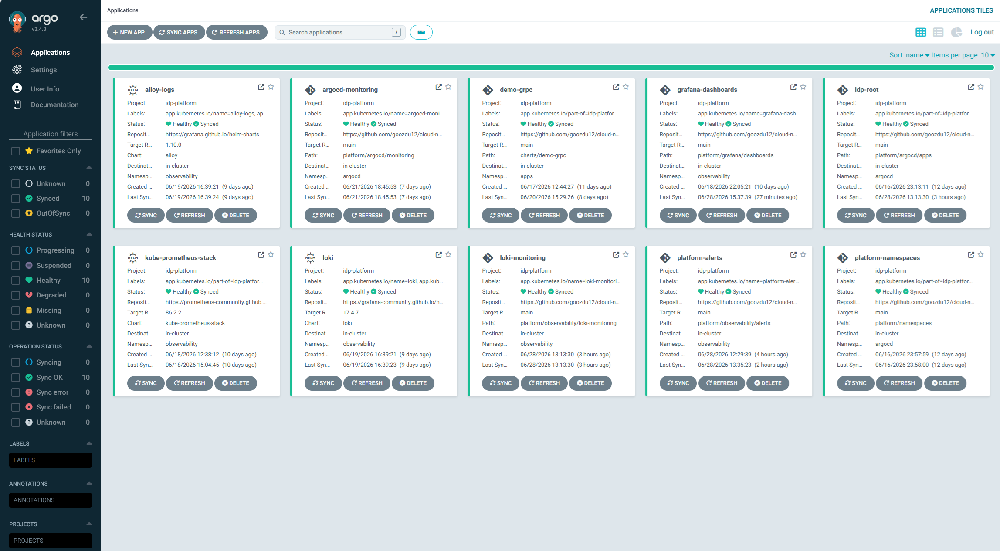

### 2. Grafana SRE Summary dashboard

This screenshot shows the main SRE dashboard with application health, request rate, latency, logs, and GitOps health.

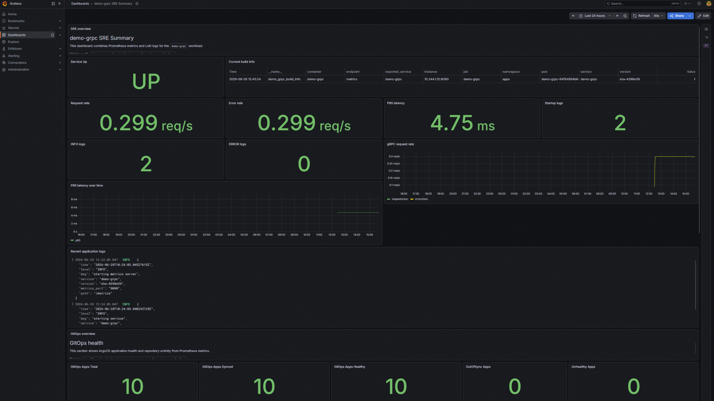

### 3. Loki backend metrics in the SRE dashboard

This screenshot shows Loki backend health, ingestion rate, error rate, memory usage, stream count, and request latency.

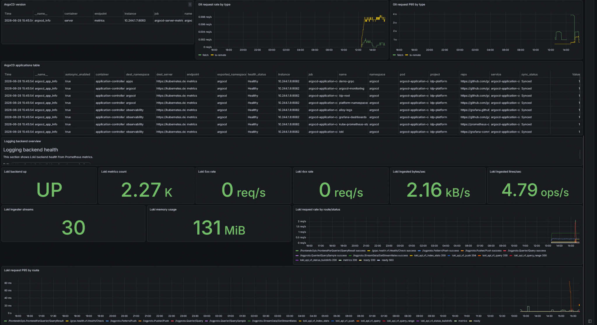

### 4. Prometheus availability alert rules

This screenshot shows the platform availability alerts, including `DemoGrpcDown`, `GrafanaDown`, and `LokiDown`.

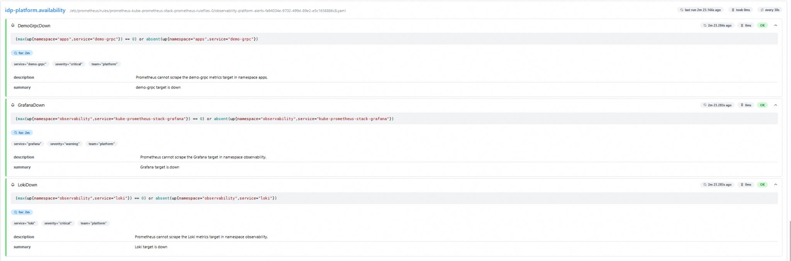

### 5. Prometheus GitOps alert rules

This screenshot shows the GitOps-related alerts for ArgoCD application health, sync drift, and ArgoCD metrics availability.

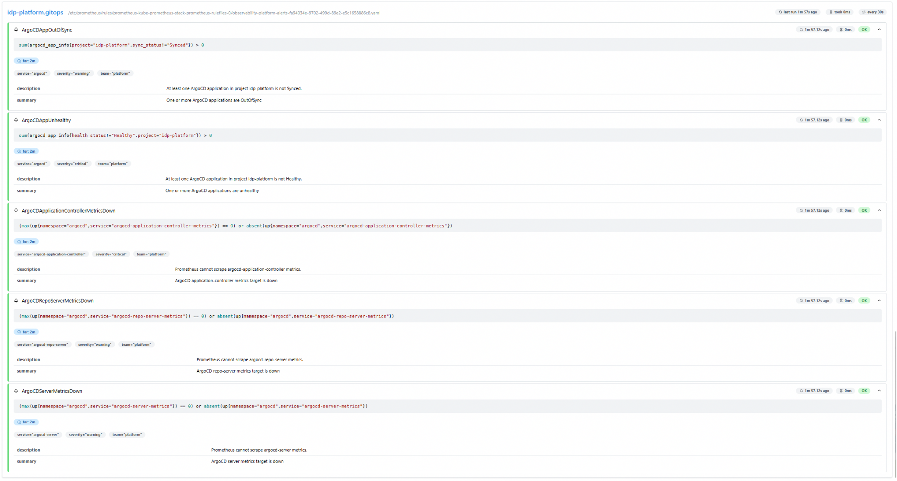

### 6. GitHub Actions CI green

This screenshot shows the GitHub Actions CI pipeline with Go test/build, Docker build, Helm validation, and Trivy security scan.

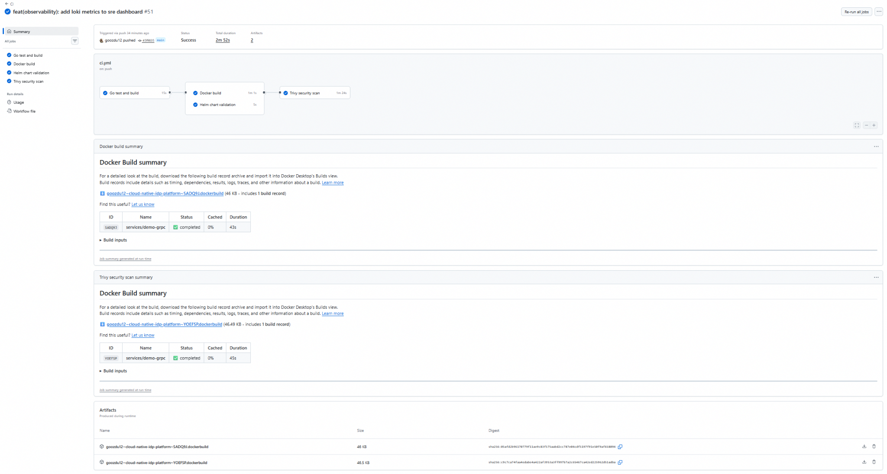


### 7. Alertmanager UI

This screenshot shows that Alertmanager is reachable and receives alerts from Prometheus.

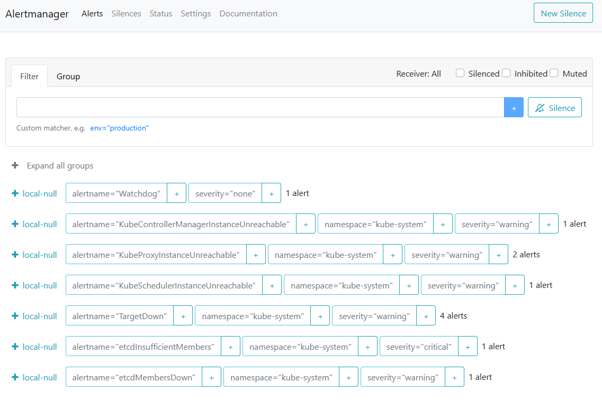

### 8. Alertmanager status and receivers

This screenshot shows that the Alertmanager routing configuration is loaded, including the local platform and GitOps receivers.

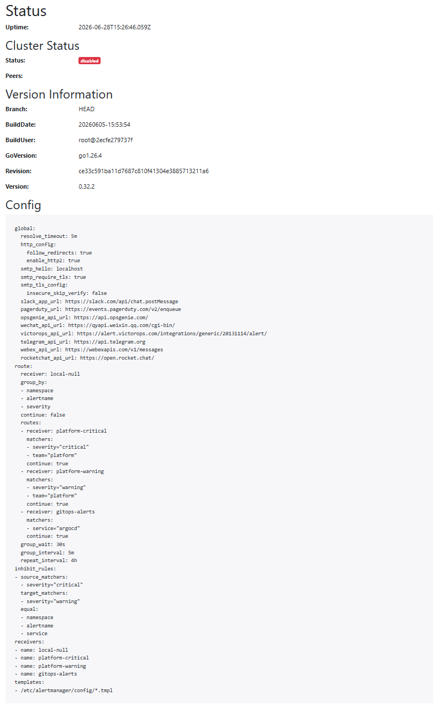

### 9. Alert runbooks documentation

This screenshot shows the alert runbook documentation used by the `runbook_url` annotations in Prometheus alert rules.

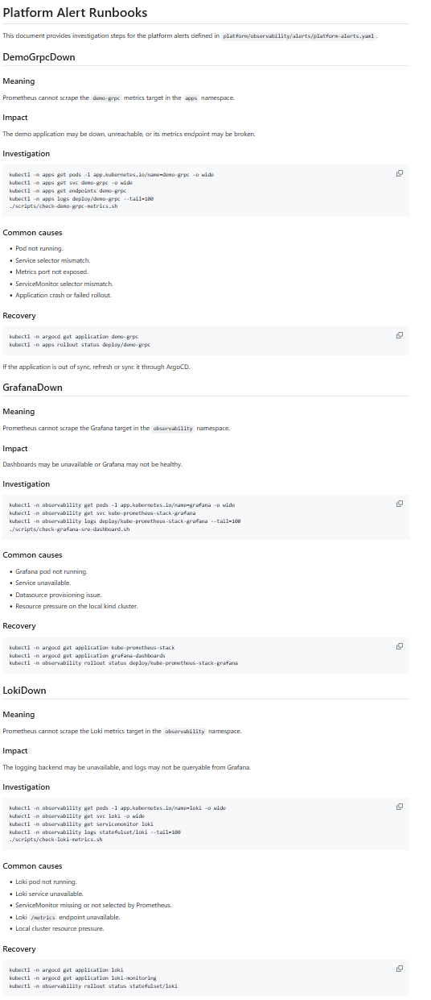


### 10. Grafana Tempo Explore traces

This screenshot shows distributed traces emitted by `demo-grpc`, exported through OpenTelemetry, stored in Tempo, and queried from Grafana Explore.

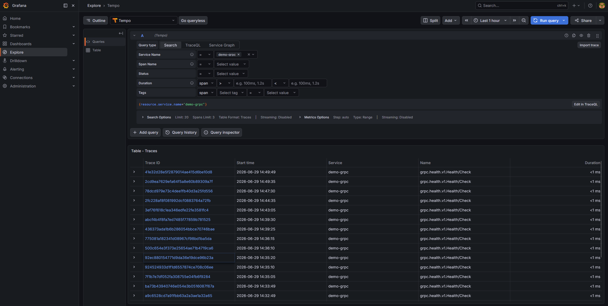

### 11. Grafana Tempo trace detail

This screenshot shows a detailed trace view for a gRPC health check span.

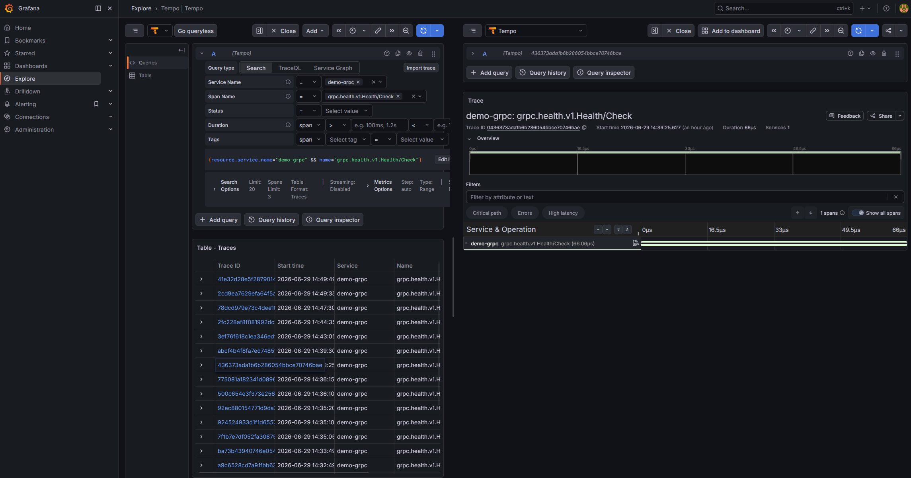

### 12. Tempo API trace search

This screenshot shows a direct Tempo API query returning `demo-grpc` traces.

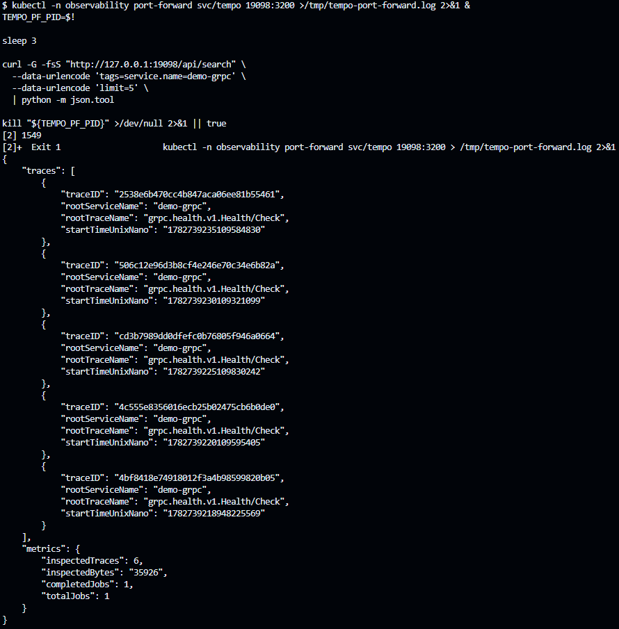


### 13. Grafana SRE dashboard Tempo panels

This screenshot shows the SRE dashboard extended with Tempo tracing backend health panels, including Tempo availability, metrics count, ingested spans rate, request error rate, and request latency.

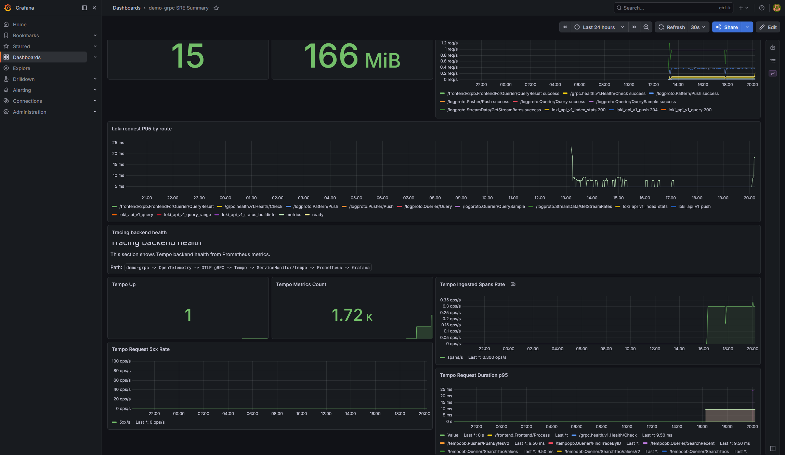


### 14. Grafana SRE dashboard SLO panels

This screenshot shows the SRE dashboard extended with service-level objectives for `demo-grpc`, including availability target, success ratio, error ratio, burn rate, request rate, and latency p95.

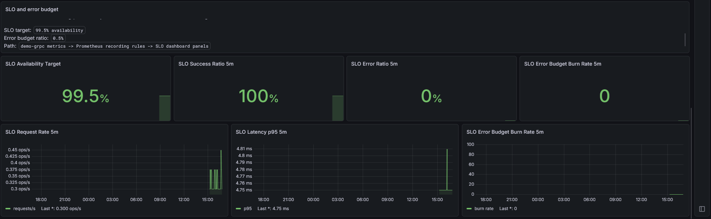


### 15. Reliability drill — demo-grpc outage simulation

This evidence shows a controlled incident simulation where `demo-grpc` is scaled down to zero replicas to validate the full alerting lifecycle.

Validated incident lifecycle:

```text
demo-grpc outage
  -> DemoGrpcDown pending in Prometheus
  -> DemoGrpcDown firing in Prometheus
  -> Alertmanager receives active DemoGrpcDown alert
  -> demo-grpc is restored
  -> DemoGrpcDown clears
  -> platform health checks pass
```

The drill is automated by:

```bash
./scripts/drill-demo-grpc-down.sh
```

Post-drill validation is performed with:

```bash
./scripts/check-demo-grpc-slo.sh
./scripts/check-platform-alerts.sh
./scripts/check-alertmanager.sh
```

Detailed drill documentation: [docs/INCIDENT_DRILLS.md](INCIDENT_DRILLS.md)


## Skills Demonstrated

This phase demonstrates practical DevOps and SRE skills:

- Kubernetes observability design.
- GitOps with ArgoCD app-of-apps.
- Prometheus ServiceMonitor usage.
- Grafana dashboard provisioning.
- Loki and Alloy log pipeline.
- Prometheus alerting.
- SRE dashboard design.
- CI/CD validation with GitHub Actions.
- Container image build validation.
- Security scanning with Trivy.
- Operational runbook-style validation scripting.
- Windows/Git Bash compatibility hardening for local DevOps workflows.

## Interview Talking Points

This implementation can be explained in an interview as follows:

- I built a GitOps-managed observability layer for a Kubernetes platform.
- The application exposes metrics and structured JSON logs.
- Prometheus scrapes application, ArgoCD, Grafana, and Loki metrics.
- Alloy collects pod logs and forwards them to Loki.
- Grafana provides dashboards for application health, logs, GitOps state, and logging backend health.
- PrometheusRule objects define alerts for service availability, Loki availability, and GitOps drift.
- I created validation scripts so the platform can be checked quickly and reproducibly.
- The CI pipeline validates code, Docker builds, Helm manifests, and security vulnerabilities with
  Trivy.
- The result is a small but realistic SRE platform that connects metrics, logs, alerts, dashboards,
  GitOps, and CI evidence.

## Current Status

```text
GitOps applications:    Synced and Healthy
Grafana SRE dashboard:  Provisioned and reachable
Loki metrics:           Scraped by Prometheus
Platform alerts:        Loaded and healthy
Current platform alerts: None firing
CI:                     Green
```

## Next Improvements

Potential next steps:

- Add Alertmanager routing and notification receivers.
- Add runbooks linked from Prometheus alerts.
- Add OpenTelemetry tracing with Tempo.
- Add RED/USE dashboard conventions.
- Add synthetic probes with blackbox-exporter.
- Add SLOs and error budget panels.
- Add screenshots directly into this documentation page.
- Add a public portfolio summary in the repository README.
